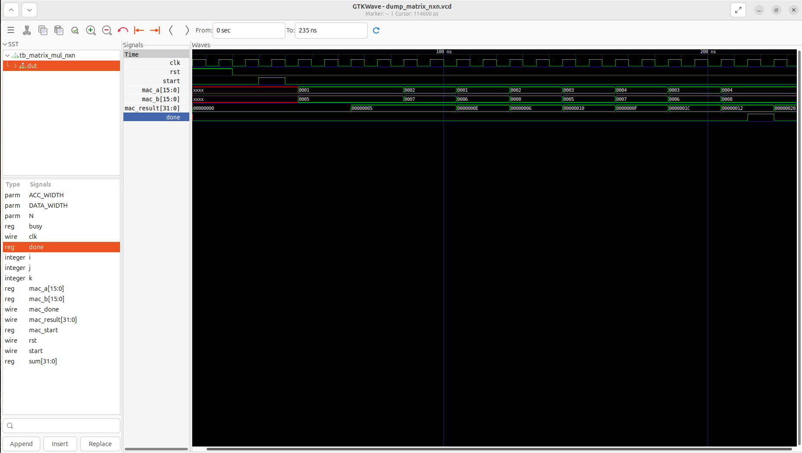

# MAC-based Matrix Multiplication RTL Accelerator

A **parameterized MAC-based hardware accelerator** for matrix multiplication implemented in **Verilog RTL**.  
This project demonstrates the design of a **Multiply–Accumulate (MAC) unit** and its reuse to compute **N×N matrix multiplication**, verified through simulation using **Icarus Verilog** and **GTKWave**.

---

## Features

- **MAC-based accelerator architecture**
- Supports **scalar MAC operation** and **N×N matrix multiplication**
- Fully **parameterized design**
  - `DATA_WIDTH`
  - `ACC_WIDTH`
  - `N` (matrix dimension)
- Clean **control + datapath separation**
- Verified with **testbenches and waveform analysis**

---

## Architecture Overview

### Core Building Blocks
- **Multiplier** – Computes product of two inputs
- **MAC Datapath** – Accumulates multiplication results
- **MAC Controller (FSM)** – Controls sequencing and handshaking
- **MAC Top** – Integrates control and datapath
- **Matrix Multiply (N×N)** – Reuses single MAC unit iteratively

---

## Project Structure

    Mac-based-matrix-multiplication-RTL/
    ├── rtl/
    │   ├── multiplier.v
    │   ├── mac_datapath.v
    │   ├── mac_control.v
    │   ├── mac_top.v
    │   ├── matrix_mul_top.v
    │   └── matrix_mul_nxn.v
    │
    ├── tb/
    │   ├── tb_mac.v
    │   ├── tb_matrix_mul.v
    │   └── tb_matrix_mul_nxn.v
    │
    ├── waveforms/
    │   ├── README.md
    │   └── matrix_mul_nxn_waveform.png
    │
    ├── README.md
    └── LICENSE

---

## Simulation & Verification

---

### Run MAC Accelerator

    iverilog -g2012 \
    rtl/multiplier.v \
    rtl/mac_datapath.v \
    rtl/mac_control.v \
    rtl/mac_top.v \
    tb/tb_mac.v \
    -o sim/mac.out

    vvp sim/mac.out

---

### Run NXN Matrix Multiplication

    iverilog -g2012 \
    rtl/multiplier.v \
    rtl/mac_datapath.v \
    rtl/mac_control.v \
    rtl/mac_top.v \
    rtl/matrix_mul_nxn.v \
    tb/tb_matrix_mul_nxn.v \
    -o sim/matrix_nxn.out

    vvp sim/matrix_nxn.out

---

### View Waveform

    gtkwave dump_matrix_nxn.vcd

---

## Waveform Analysis

Waveform-based verification was performed using **GTKWave** to validate correct functionality and control sequencing of the MAC-based matrix multiplication accelerator.

### Observations
- Clean clock and reset behavior
- Correct sequencing of `mac_a` and `mac_b` inputs
- Proper accumulation of MAC results across cycles
- `start` to `done` handshake operates as expected
- Single MAC unit is reused sequentially for N×N computation

### Sample Waveform (GTKWave)

> The waveform shows sequential MAC operations corresponding to each dot-product term, confirming correct FSM control and dataflow.

### Key Signals Monitored
- `clk`
- `rst`
- `start`
- `mac_a`, `mac_b`
- `mac_result`
- `done`

Waveform inspection confirms **cycle-accurate behavior** and correctness of the accelerator design.

## Results

- ✅ Correct MAC accumulation verified  
- ✅ Correct **N×N matrix multiplication** output  
- ✅ Waveforms validated using **GTKWave**  
- ✅ Design operates correctly across different **parameter values**

---

## Design Highlights

- Single **MAC unit reused** for full matrix multiplication  
- **FSM-based control** for clean sequencing and synchronization  
- Modular RTL design, easy to extend to:
  - Parallel MAC arrays
  - Pipelined MAC architecture
  - RISC-V coprocessor / accelerator integration

---

## Learning Outcomes

- RTL design using **Verilog HDL**
- Clear **control–datapath separation**
- Finite State Machine (**FSM**) design
- Accelerator-oriented hardware design approach
- Writing and debugging **testbenches**
- **Waveform-based verification** using GTKWave
